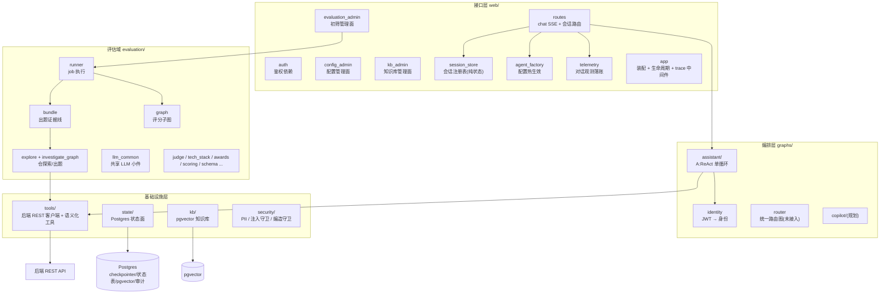
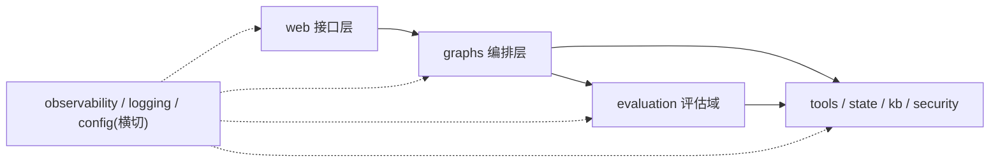
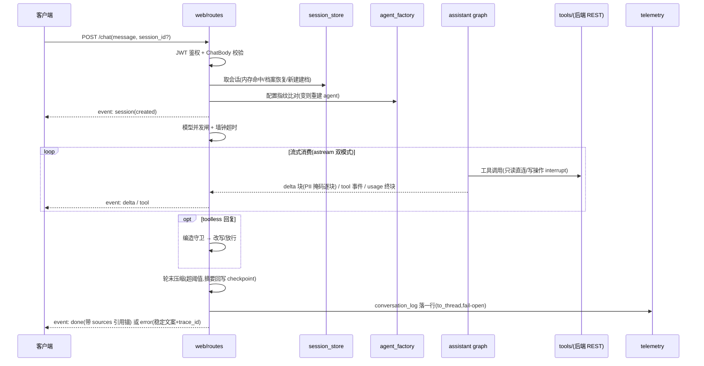
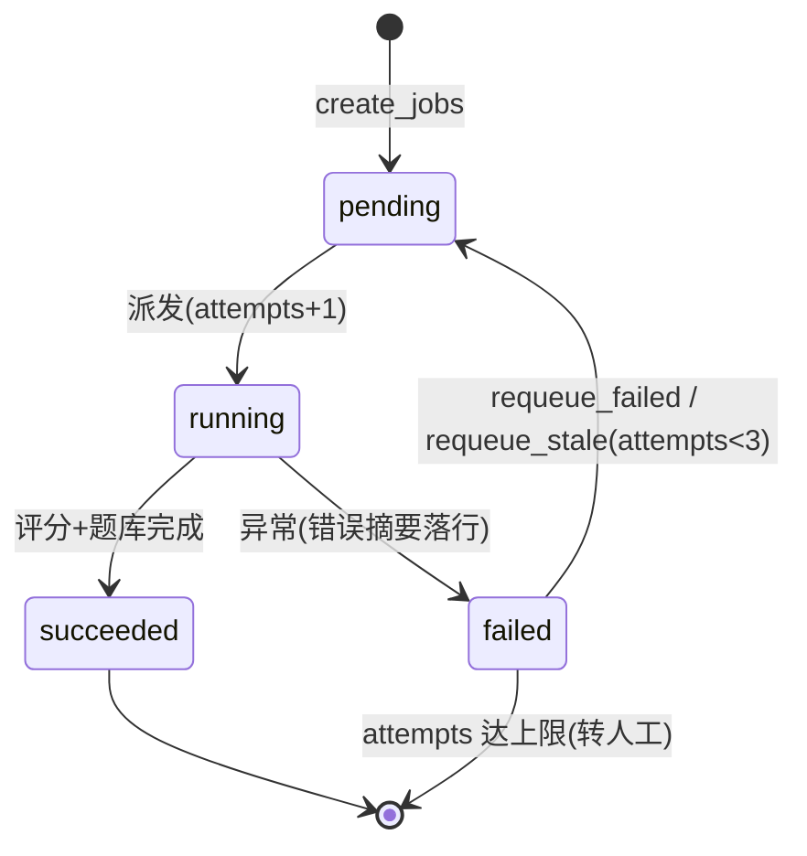
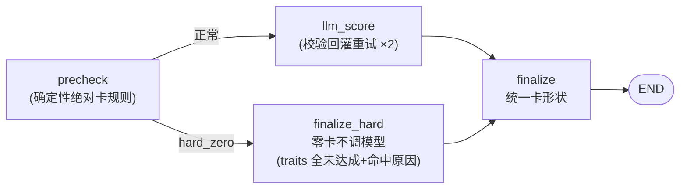
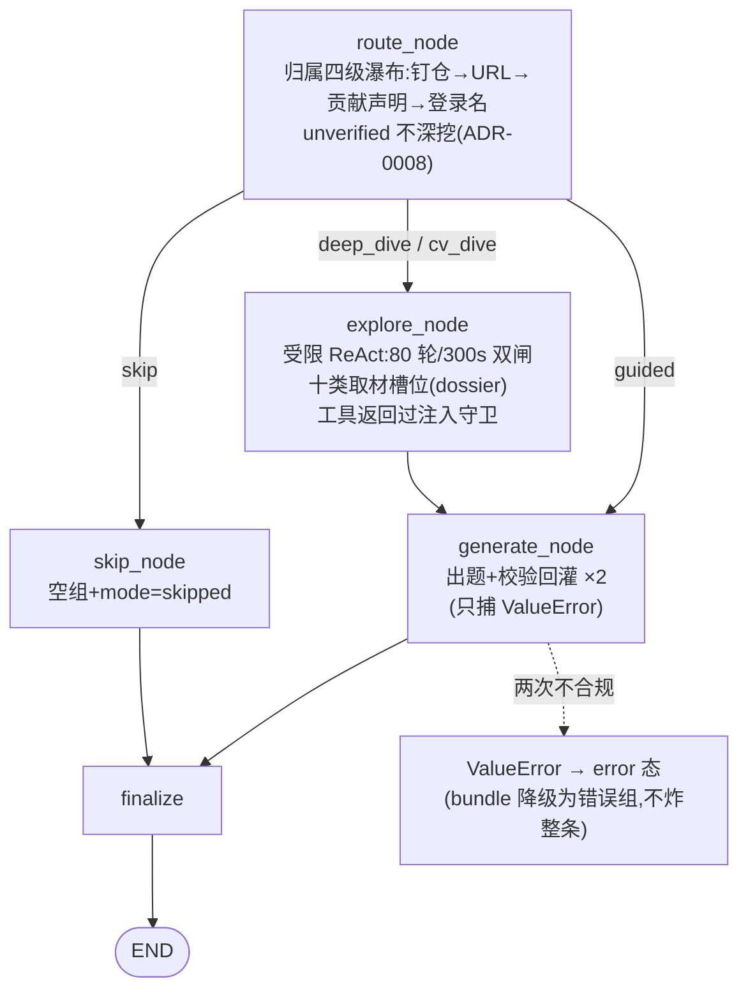
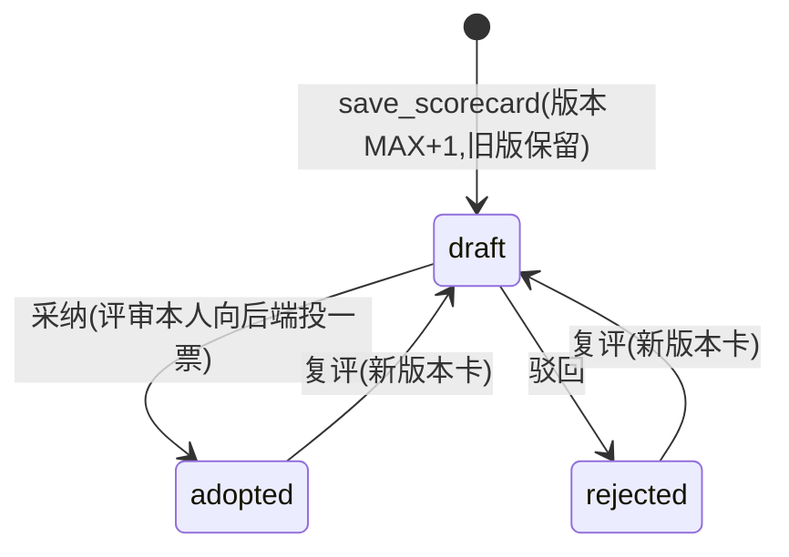
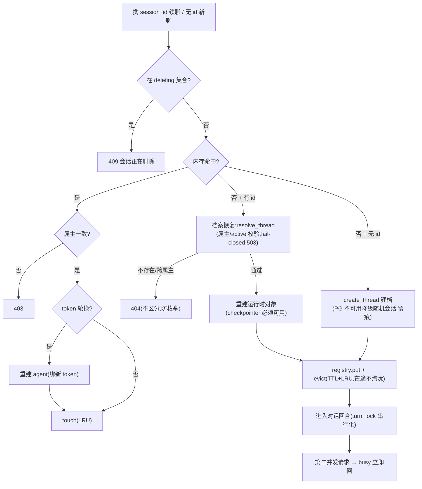

# 代码架构详解

> **这是什么**:本仓代码结构的深度导览——分层、包结构、设计模式、复杂业务逻辑的图形化表示。
> **何时读**:接手模块、评审设计、排查跨层问题之前;`docs/design.md` 讲"做什么与为什么",
> 本文讲"代码怎么组织、怎么流转"。
> 图为 Mermaid,与代码的对应关系以**符号名**标注,重构后以代码为准。

## 1. 总览:四层骨架 + 三个能力模块



三个能力模块共用同一套工具层与状态设施(ADR-0003:入口各自直连,无统一意图路由):

| 模块 | 入口 | 编排 |
|---|---|---|
| A 对话助理 | 官网 SSE / CLI | `graphs/assistant` ReAct 单循环 |
| B 评估流水线 | 管理面 / 启动自动恢复 | `evaluation/runner` + LangGraph 子图 |
| C 面试官 Copilot | 官网管理端(规划) | `graphs/copilot`(预留) |

## 2. 包结构

```
src/official_agent/
├── web/                    # 接口层:FastAPI 路由与入口横切
│   ├── app.py              #   create_app:lifespan(自举/恢复/后台任务)+ trace 中间件 + 路由注册
│   ├── routes.py           #   /chat SSE、/sessions 会话路由、/admin/conversations 运营视图
│   ├── auth.py             #   authenticate(JWT→身份)+ require_any 权限工厂(唯一出处)
│   ├── session_store.py    #   进程内会话注册表:TTL+LRU 淘汰、删除中协调(零 FastAPI 依赖)
│   ├── agent_factory.py    #   配置指纹比对 → agent 热重建
│   ├── telemetry.py        #   conversation_log 落账、KB 引用锚收集、usage/前缀指纹
│   ├── config_admin.py     #   /admin/config:低敏热改 + 高敏掩码 + base_url 白名单
│   ├── kb_admin.py         #   /admin/kb*:知识条目 CRUD/入库重嵌
│   └── evaluation_admin.py #   /admin/evaluation*:触发/队列/维卡/采纳/驳回/题库
├── graphs/                 # 编排层:LangGraph 图
│   ├── assistant/          #   A:build_assistant_agent(create_agent ReAct)+ 会话压缩
│   ├── identity.py         #   JWT → ResolvedIdentity(权限码/角色/属主)
│   ├── router.py           #   统一路由图(预留,未接入)
│   └── copilot/            #   C:面试官 Copilot(预留)
├── evaluation/             # 评估域:流水线领域逻辑
│   ├── runner.py           #   EvaluationRunner:submit/派发/_execute_job(评分段+题库段)
│   ├── graph.py            #   评分子图:precheck→(hard_zero? finalize_hard : llm_score)→finalize
│   ├── investigate_graph.py#   调查出题子图:route→explore→generate(含 skip/guided 分支)
│   ├── bundle.py           #   出题证据线:仓线/评测错因线/奖项线/兜底线 → qbank 信封
│   ├── explore.py          #   受限 ReAct 仓探索(轮数/墙钟双闸 + dossier 槽位)
│   ├── judge.py / tech_stack.py / awards.py   # 专项出题
│   ├── scoring.py          #   量规计算 + ai_level 三档等级
│   ├── schema.py           #   数据契约(ScorecardOutput/QbankV2/QuestionGroupV2...)
│   ├── llm_common.py       #   共享小件:content_text/prompt_version/温度定档/invoke_with_retry
│   ├── runner 依赖的 github_client / autograding / attribution / dossier
│   └── state/evaluation/(见 state/)
├── state/                  # 基础设施:Postgres 状态面(Repository 语义)
│   ├── pg.py               #   checkpointer 连接 + 挂起载荷清理
│   ├── threads.py          #   agent_threads:会话档案(建档/属主校验/硬删)
│   ├── conversation.py     #   agent_conversation_log:对话日志 + usage 解包
│   ├── evaluation/         #   包:scorecard_store / job_store / review_queue / bootstrap / _connection(池)
│   ├── qbank.py            #   interview_qbank:题库 + pick_log
│   ├── audit.py            #   agent_audit_log:审计(五字段,ADR-0006)
│   └── config_store.py     #   agent_config:热配置(DB 覆盖 env)
├── tools/                  # 基础设施:后端 REST 的语义化封装
│   ├── client.py           #   BackendClient + 异常层级(AuthError/UnavailableError/BackendError)
│   ├── readonly.py         #   只读工具(按意图命名,返回投影裁剪)
│   ├── write.py            #   写工具(仅进程内,interrupt 指纹令牌)
│   └── knowledge.py        #   search_knowledge(知识库检索,降级契约)
├── kb/                     # 知识库:chunking / embedding / schema / store
├── security/               # 横切:pii(脱敏)/ injection_guard(数据区+扫描)/ fabrication_guard
├── prompts/                # prompt 唯一权威(一图一节点一文件 + frontmatter,ADR-0004)
├── evals/                  # eval 集 + 统一 runner(python -m evals / evals/run_evals.py)
├── observability.py        # Langfuse 接线(fail-open)+ trace id(contextvar/W3C)+ PII 遮蔽 handler
├── config.py               # Settings(env)+ HOT_KEYS + get_effective_settings(DB 覆盖)
├── credentials.py          # 服务账号凭证(0600 文件)
├── logging_conf.py         # 日志(stdout+落盘,TraceIdFilter 注入 trace_id)
└── cli.py / mcp_server.py  # CLI 入口 / MCP 对外暴露(维护态)
```

## 3. 依赖规则



- **单向向下**,禁止反向与跨层跳跃;领域规则不 import 基础设施实现细节
- **接口层只做编排**:校验 → 调用 → 组装;业务规则在 evaluation/编排层,不在 route
- **基础设施不感知上层**:tools 不知道 graphs,state 不知道 web
- 例外与边界:web/telemetry 可以 lazy import `state.conversation`(观测面,函数内导入保持
  "web 入口无 PG 可跑"纪律)

## 4. 设计模式与惯用法(模式 → 落点)

| 模式/惯用法 | 落点 | 说明 |
|---|---|---|
| **权限工厂**(Factory + 闭包) | `web/auth.require_any(*codes)` | 生成 FastAPI 依赖;单码直接 `require_any("code")`,消灭五份复制品 |
| **构造器注入** | `agent_factory.ensure_fresh_agent(build_agent=...)` | 重建构造器由调用方注入,模块不绑定装配实现 |
| **双检锁单例** | `evaluation/bootstrap.ensure_once`、`_connection.get_pool`、`routes._get_model_gate` | 每进程一次的自举/懒建资源 |
| **哨兵对象** | `job_store._Unset` | 区分「没传这列」与「显式置 NULL」,mark_job 只更新显式列 |
| **状态机** | evaluation_job / scorecard | 见 §6.4;部分唯一索引兜底活跃唯一性 |
| **管道/子图** | LangGraph 三图 | 见 §6.2/6.3;节点纯函数 `(state) -> dict` |
| **校验回灌重试** | `llm_common.invoke_with_retry` | 只捕 ValueError 回灌模型自纠;程序缺陷向上暴露 |
| **降级双轨** | 观测 fail-open / 写路径 fail-closed(ADR-0005) | 每处降级必须留痕(日志),注释说明为什么安全 |
| **Repository 语义** | `state/*_store` | 方法名说业务(`find_active_users` 式),SQL 不上浮 |
| **投影(读模型)** | `review_queue.list_review_queue` | DISTINCT ON 最新卡 + LATERAL 归属/决策历史 |
| **装饰式包装** | `_PiiMaskedLangfuseHandler` | 委托 Langfuse handler,消息/载荷统一脱敏(fail-closed) |
| **端口适配** | `tools/client.py`(后端 REST)、LLM 统一经 `build_model` | 第二实现出现才抽接口(YAGNI,ADR-0009) |
| **参数注入时钟** | `session_store.evict_locked(now)`、压缩判定 | 可测性根基:测试不 sleep |

## 5. 对话回合(A 模块主链路)



失败收敛:闸满(busy)/超时(timeout)/断连(client_disconnected)/异常(按异常类型分类)
五条路径都收敛到**同一落账点**,客户端只见稳定错误码。

## 6. 评估流水线(B 模块)

### 6.1 job 生命周期

```mermaid
flowchart TD
    S["POST /admin/evaluation/run"] --> AUTH["权威归属核对<br/>(后端按简历号派生 user_id)"]
    AUTH -->|"错位 → SubmissionDataError → 400"| FAIL
    AUTH --> CJ["create_jobs(幂等:活跃 job 复用<br/>部分唯一索引兜底,逐条事务)"]
    CJ --> D["派发(_sem 并发闸)"]
    D --> P["pending"]
    P --> R["running(attempts+1,简历状态 6)"]
    R --> SC["评分段 _do_scoring<br/>取数→归属硬断言→脱敏→评分子图→落卡"]
    SC --> QB["题库段 _do_qbank<br/>出题 bundle→落库→用量日志"]
    QB -->|成功| OK["succeeded<br/>(card_version + qbank_status)"]
    QB -->|题库线失败| OKF["succeeded + qbank_status=failed<br/>(评分卡有效,原因直达管理面)"]
    SC -->|失败| F["failed(error 摘要,<br/>简历状态回 2,可重试)"]
    F -->|requeue(attempts<3)| P
    F -->|attempts 达上限| MAN["人工队列"]
```



### 6.2 评分子图(hard_zero 短路)



### 6.3 调查出题子图(route → explore → generate)



explore 的工具执行内循环(`_run_tool_calls`):逐调用判**轮数/墙钟双硬闸**,dossier 槽位满
则静默丢弃并回执模型;ToolMessage 严格紧跟 tool_calls(OpenAI 消息序纪律)。

### 6.4 scorecard 状态机



## 7. 会话生命周期(web)



## 8. 数据模型(Postgres,agent 侧)

| 表 | 内容 | 关键约束 |
|---|---|---|
| `agent_threads` | 会话档案(thread_id/属主/状态) | thread_id 全局唯一;软删+保留期清理 |
| `agent_conversation_log` | 对话日志(问题摘要/工具/耗时/usage/trace) | fail-open 写入 |
| `evaluation_scorecard` | AI 参考分卡(card JSONB/total/hard_zero) | UNIQUE(resume,cycle,card_version);状态机 CHECK |
| `evaluation_job` | 执行 job(状态机/attempts/qbank_status) | 部分唯一索引:活跃 job 每 (resume,cycle) 一条 |
| `interview_qbank` | 题库信封(v2 JSONB) | 版本递增 |
| `qbank_pick_log` | 面试官选题记录 | 服务端权威引用(防伪造证据路径) |
| `agent_audit_log` | 审计(ADR-0006 五字段) | 代理身份+trace_id |
| `agent_config` | 热配置低敏键 | 白名单 HOT_KEYS |
| `kb_source` / `kb_faq` / `kb_doc` / `kb_chunks` | 知识库来源/内容/向量 | 禁跨 embedding 模型混排 |

## 9. 横切机制

- **trace 串联**:三入口(web 中间件/CLI/eval job)置轮级 id(归一 W3C 32-hex)→
  出站 `traceparent` → 审计 trace_id → 日志 `[trace_id]`,四面同 id(ADR-0012)
- **PII 分层边界**:工具出口 `mask_pii_deep` → trace 采集侧遮蔽(handler)→ 模型输出
  侧守卫 → 挂起载荷 TTL
- **错误分类**:类型判定(`BackendAuthError`/`BackendUnavailableError`/`BackendError`)→
  稳定错误码;受控领域文案是对外契约,未预期异常原文不出边界(ADR-0011)
- **配置热生效**:PUT /admin/config → DB upsert + 缓存失效 → 每轮指纹比对 → 变则重建
  agent(`agent_factory`,读取失败留痕降级)

## 10. 测试与质量门禁

| 层 | 位置/命令 | 把关内容 |
|---|---|---|
| 单测 | `uv run pytest`(709+) | 确定性逻辑:工具/图结构/权限/脱敏/状态面(mock 连接) |
| 集成 | pgvector 容器 + `POSTGRES_URL=... pytest tests/*_pg.py tests/test_kb_integration.py` | DDL 幂等/唯一索引/事务边界/锁纪律(自 SKIP 不算通过) |
| eval | `python evals/run_evals.py` | 工具选择/参数红线(forbidden_tools)、阈值门禁、LLM-as-judge |
| 机械 | `uv run ruff check .` | lint(line-length 100) |

评分分级可见与客服面红线有专门保证测试:`test_no_role_assembles_score_tools`
(装配层)、`test_assistant_surface_never_imports_evaluation_store`(tripwire)、
`ts-score-not-exposed-*`(eval 行为红线)。

## 文档地图

- 产品设计与决策背景:`docs/design.md` + `docs/adr/`
- 工程规范(分层/错误/日志/注释):`docs/standards/`
- 重构计划与进度:`docs/refactor-roadmap.md`
- 评测可观测 runbook:`docs/eval-observability.md`
